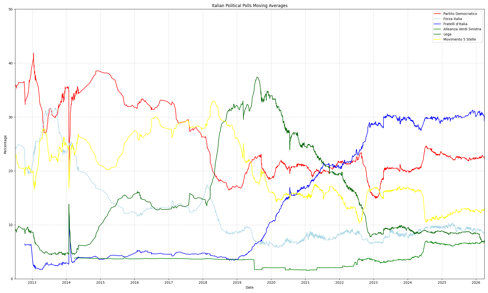

<a href="https://datibenecomune.substack.com/about"></a>

Se vuoi più informazioni su questo progetto, ne ho parlato su [datiBeneComune](https://datibenecomune.substack.com/) in [questo numero](https://datibenecomune.substack.com/p/liberiamoli-tutti-numero-8).

## Media di oggi

Fratelli d'Italia: 30.01%  
Partito Democratico: 22.31%  
Movimento 5 Stelle: 12.93%  
Forza Italia: 9.23%  
Lega: 8.64%  
Alleanza Verdi Sinistra: 6.60%  
Azione: 3.22%  
Altri: 2.89%  
Italia Viva: 2.29%  
+Europa: 1.88%  
## Grafico


# Archiving Italian Political Polls

Questo progetto si occupa di archiviare tutti i sondaggi mai caricati sul sito ufficiale [sondaggipoliticoelettorali.it](https://www.sondaggipoliticoelettorali.it/), cercando quelli che riguardano l'intenzione di voto nazionale utilizzando il confronto di stringhe e l'estrazione delle risposte al sondaggio utilizzando un Large Language Model (LLM).
Per a chi interessano solo i dati dei sondaggi aggiornati giornalieramente, sono disponibili in formato JSONL nel file `italian_polls.jsonl` e in formato CSV nel file `italian_polls.csv`. Se invece si desiderano i dati in formato long e ulteriormente puliti, sono disponibili alla sequente repo di onData: [italian_polls](https://github.com/ondata/liberiamoli-tutti/tree/main/italian_polls)

## Requisiti

Avere un'installazione di Python con un setup di Selenium funzionante e le librerie `openai` e `bs4` installate.
Avere nel proprio environment la variabile d'ambiente `OPENAI_API_KEY` settata con la propria chiave API di OpenAI.
Per esserne sicuri, basta installare i requisiti con il seguente comando:

```shell
pip install -r requirements.txt
```


## Installazione

1. Clona il repository sul tuo computer:

```shell
git clone https://github.com/ruggsea/llm_italian_poll_scraper.git
```

2. Entra nella directory del progetto:

```shell
cd llm_italian_poll_scraper
```

## Utilizzo

I sondaggi dovrebbero essere archiviati nel file `italian_polls.jsonl` in formato JSONL. Per aggiornare il file con i nuovi sondaggi, esegui il seguente comando:

```shell
python3 llm_poll_parser/archiving_polls.py
```


## Note

La media si basa sui sondaggi archiviati nel file `italian_polls.jsonl` e viene calcolata tramite media mobile a peso esponenziale (EWMA). Il grafico non riporta Azione, +Europa e Italia Viva poiché le loro unioni e divisioni rendono difficile rappresentarne una serie storica (sono tuttavia presenti nei dati raccolti).

Mentre il dataset è molto affidabile per i sondaggi odierni, potrebbero esserci errori nei sondaggi più vecchi. In particolare, alcuni sondaggi risultano sfasati o vuoti per via di errori di parsing o di mancato filtraggio. Varie correzioni nel parsing sono state apportate: per vederne i frutti, saltuariamente conduco uno scrape completo per ricostruire il dataset da zero usando la versione più aggiornata dello scraper.

## Partiti considerati

Sono considerati in maniera abbastanza esaustiva tutti i partiti sondati nei sondaggi archiviati sul sito (2013-presente). I partiti considerati sono:

- Fratelli d'Italia
- Partito Democratico
- Movimento 5 Stelle
- Forza Italia
- Lega
- Alleanza Verdi Sinistra
- Azione
- Italia Viva
- +Europa
- Pace Terra Dignità
- Sud Chiama Nord
- Stati Uniti d'Europa
- Azione/+Europa
- Azione - Italia Viva
- Unione Popolare
- Sinistra Ecologia Libertà
- Unione di Centro
- Scelta Civica

Sono incoraggiati consigli e suggerimenti su partiti da aggiungere, altri miglioramenti e correzione dei dati: in caso aprire una issue. Grazie!

Per domande, chiarificazione o contatti media contattemi su fu twitter at [ruggsea](https://twitter.com/ruggsea) o al seguente profilo [LinkedIn](https://www.linkedin.com/in/ruggsea/).

## Se usi questi dati

I dati sono rilasciati con licenza **CC BY 4.0**, quindi sei libero di utilizzarli per qualsiasi scopo, a patto di **citare questa fonte**. 

Quando li usi includi per favore la dicitura "dati estratti da [Ruggero Marino Lazzaroni](https://github.com/ruggsea/llm_italian_poll_scraper)", mettendo il link a questo repository (il link è <https://github.com/ruggsea/llm_italian_poll_scraper>).

