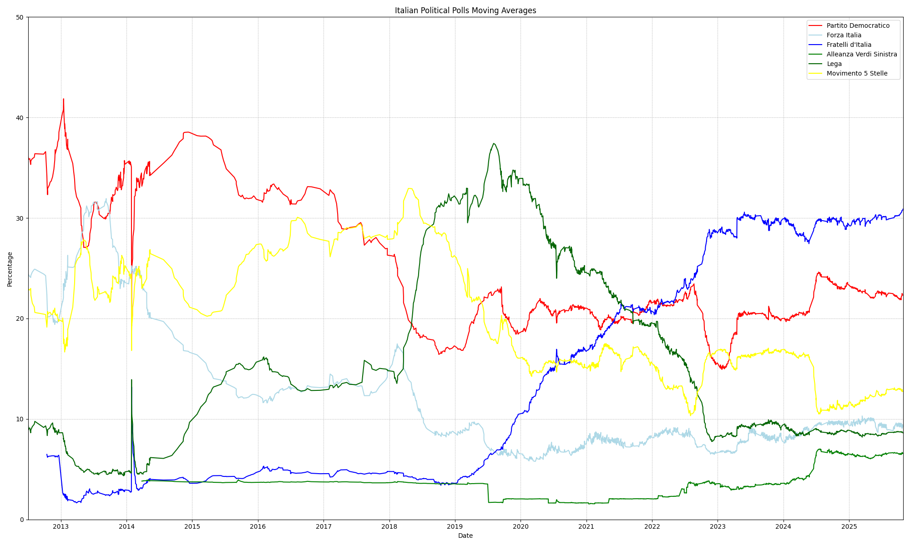

## Media di oggi

Fratelli d'Italia: 29.61%  
Partito Democratico: 23.44%  
Movimento 5 Stelle: 10.91%  
Forza Italia: 9.33%  
Lega: 8.45%  
Alleanza Verdi Sinistra: 6.81%  
Altri: 4.22%  
Azione: 3.17%  
Italia Viva: 2.23%  
+Europa: 1.85%  
## Grafico


# Archiving Italian Political Polls

Questo progetto si occupa di archiviare tutti i sondaggi mai caricati sul sito ufficiale [sondaggipoliticoelettorali.it](https://www.sondaggipoliticoelettorali.it/), cercando quelli che riguardano l'intenzione di voto nazionale utilizzando il confronto di stringhe e l'estrazione delle risposte al sondaggio utilizzando un Large Language Model (LLM).
Per a chi interessano solo i dati dei sondaggi aggiornati giornalieramente, sono disponibili in formato JSONL nel file `italian_polls.jsonl` e in formato CSV nel file `italian_polls.csv`.

## Requisiti

Avere un'installazione di Python con un setup di Selenium funzionante e le librerie `openai` e `bs4` installate.
Avere nel proprio environment la variabile d'ambiente `OPENAI_API_KEY` settata con la propria chiave API di OpenAI.
Per esserne sicuri, basta installare i requisiti con il seguente comando:

```shell
pip install -r requirements.txt
```


## Installazione

1. Clona il repository sul tuo computer:

```shell
git clone https://github.com/ruggsea/llm_italian_poll_scraper.git
```

2. Entra nella directory del progetto:

```shell
cd llm_italian_poll_scraper
```

## Utilizzo

I sondaggi dovrebbero essere archiviati nel file `italian_polls.jsonl` in formato JSONL. Per aggiornare il file con i nuovi sondaggi, esegui il seguente comando:

```shell
python3 llm_poll_parser/archiving_polls.py
```


## Note

La media si basa sui sondaggi archiviati nel file `italian_polls.jsonl` e viene calcolata tramite media mobile a peso esponenziale (EWMA). Il grafico non riporta Azione, +Europa e Italia Viva poiché le loro unioni e divisioni rendono difficile rappresentarne una serie storica (sono tuttavia presenti nei dati raccolti).

